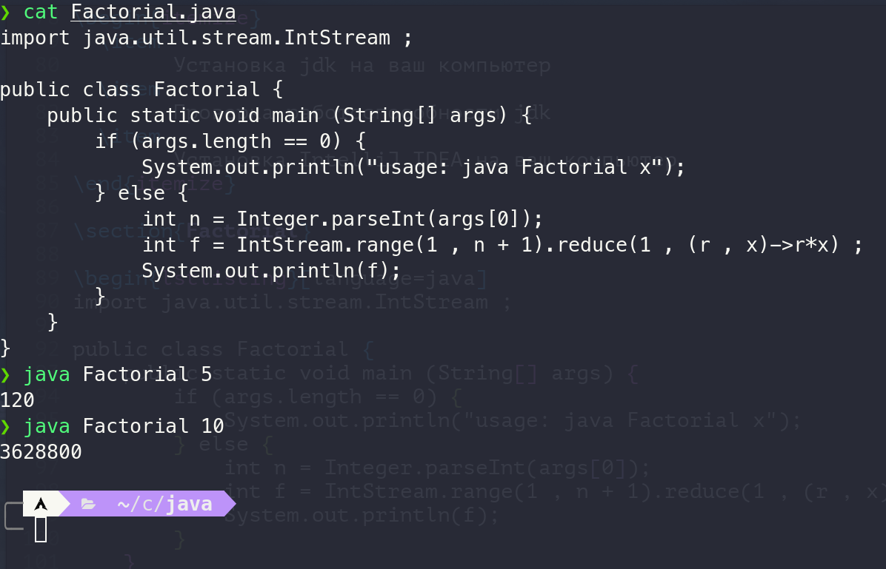
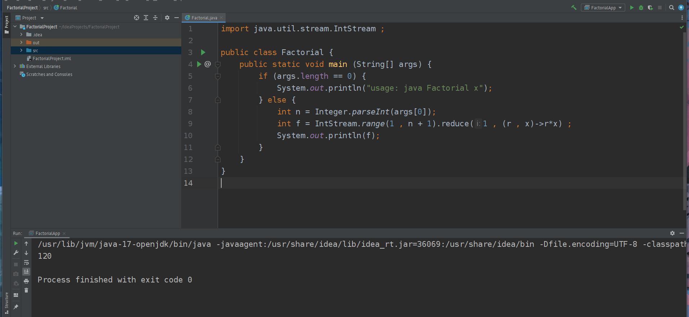
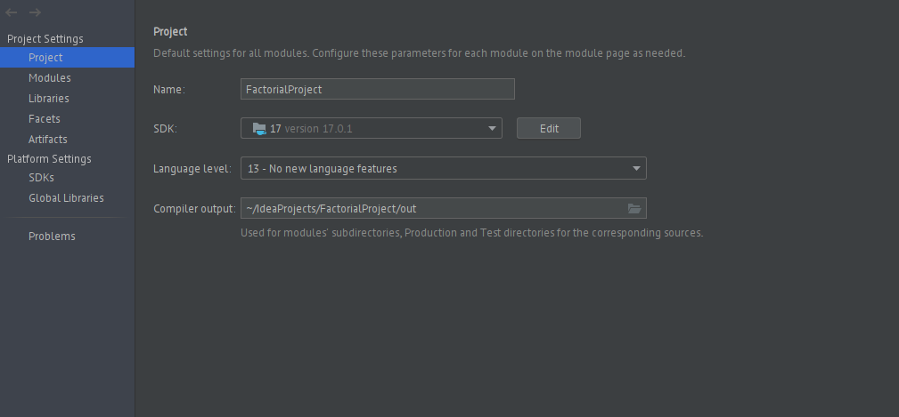

# Цели

Формирование комфортного окружения для разработки ПО на языке Java.

# Задачи

1. Установка jdk на ваш компьютер
1. Проверка работоспособности jdk
1. Установка IntelliJ IDEA на ваш компьютер

# Решение

## `Factorial.java`

```java
import java.util.stream.IntStream ;

public class Factorial {
    public static void main (String[] args) {
        if (args.length == 0) {
            System.out.println("usage: java Factorial x");
        } else {
            int n = Integer.parseInt(args[0]);
            int f = IntStream.range(1 , n + 1).reduce(1 , (r , x)->r*x) ;
            System.out.println(f);
        }
    }
}
```

## Скриншоты





