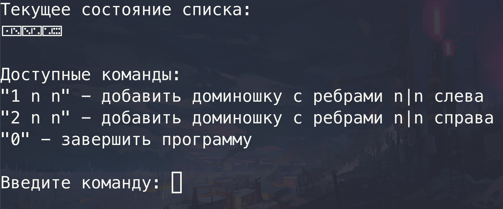

# Цели

Целью данной работы является изучение базовых возможностей языка Java.

# Задание

Класс костяшек домино с операцией присоединения одной костяшки к другой (в итоге костяшки должны образовывать двусвязный список).

# Решение

## [Репозиторий на Github](https://github.com/stewkk/iu9-java/tree/master/2)

## Код

### `DominoTile.java`

```java
public class DominoTile {
    private int firstNumber;
    private int secondNumber;
    private DominoTile next;
    private DominoTile previous;

    public DominoTile(int firstNumber, int secondNumber) {
        this.firstNumber = firstNumber;
        this.secondNumber = secondNumber;
        next = previous = null;
    }

    public DominoTile getNext() {
        return next;
    }

    public DominoTile getPrevious() {
        return previous;
    }
    public String toString() {
        return new String(Character.toChars(0x1F031 + firstNumber * 7 + secondNumber));
    }

    public void rotate() {
        int temp = firstNumber;
        firstNumber = secondNumber;
        secondNumber = temp;
    }

    public void connectLeft(DominoTile tile) throws DominoesException {
        if (firstNumber == tile.firstNumber) {
            tile.rotate();
        }
        if (tile.secondNumber != firstNumber) {
            throw new DominoesException();
        }
        tile.next = this;
        this.previous = tile;
    }

    public void connectRight(DominoTile tile) throws DominoesException  {
        if (secondNumber == tile.secondNumber) {
            tile.rotate();
        }
        if (secondNumber != tile.firstNumber) {
            throw new DominoesException();
        }
        tile.previous = this;
        this.next = tile;
    }
};
```

### `Dominoes.java`

```java
import java.util.Iterator;

public class Dominoes implements Iterable<DominoTile> {
    private DominoTile head;
    private DominoTile tail;

    public Dominoes() {
        head = tail = null;
    }

    public void addFront(DominoTile toAdd) throws DominoesException {
        if (head == null) {
            head = toAdd;
            tail = toAdd;
        } else {
            head.connectLeft(toAdd);
            head = toAdd;
        }
    }

    public void addBack(DominoTile toAdd) throws DominoesException {
        if (head == null) {
            head = toAdd;
            tail = toAdd;
        } else {
            tail.connectRight(toAdd);
            tail = toAdd;
        }
    }

    public Iterator<DominoTile> iterator() {
        return new DominoesIterator(this);
    }

    class DominoesIterator implements Iterator<DominoTile> {
        private DominoTile current;

        public DominoesIterator(Dominoes list) {
            current = list.head;
        }

        public boolean hasNext() {
            return current != null;
        }

        public DominoTile next() {
            DominoTile data = current;
            current = current.getNext();
            return data;
        }

        public void remove() {
            throw new UnsupportedOperationException();
        }
    };

    public String toString() {
        String res = "";
        for (DominoTile tile : this) {
            res += tile + " ";
        }
        return res.stripTrailing();
    }

    public boolean isEmpty() {
        return head == null;
    }
};
```

### `DominoesException.java`

```java
public class DominoesException extends Exception {
    public DominoesException() {
        super("tile ends does't match");
    }
};
```

### `Test.java`

```java
import java.util.Scanner;

public class Test {
    public static void main(String[] args) {
        Scanner stdin = new Scanner(System.in);
        Dominoes dominoes = new Dominoes();
        boolean isTilesMatch = true;

        while (true) {
            System.out.print("\033\143");
            System.out.println("Текущее состояние списка:");
            if (dominoes.isEmpty()) {
                System.out.println("Список пуст");
            } else {
                System.out.println(dominoes);
            }
            System.out.println("");
            System.out.println("Доступные команды:");
            System.out.println("\"1 n n\" - добавить доминошку с ребрами n|n слева");
            System.out.println("\"2 n n\" - добавить доминошку с ребрами n|n справа");
            System.out.println("\"0\" - завершить программу");
            System.out.println("");

            if (isTilesMatch) {
                System.out.print("Введите команду: ");
            } else {
                System.out.print("Грани не совпадают, введите новую команду: ");
                isTilesMatch = true;
            }

            int command = stdin.nextInt();

            if (command == 1) {
                int first = stdin.nextInt();
                int second = stdin.nextInt();
                try {
                    dominoes.addFront(new DominoTile(first, second));
                }
                catch (DominoesException e) {
                    isTilesMatch = false;
                }
            } else if (command == 2) {
                int first = stdin.nextInt();
                int second = stdin.nextInt();
                try {
                    dominoes.addBack(new DominoTile(first, second));
                }
                catch (DominoesException e) {
                    isTilesMatch = false;
                }
            } else {
                break;
            }
        }
    }
};
```

## Пример вывода


