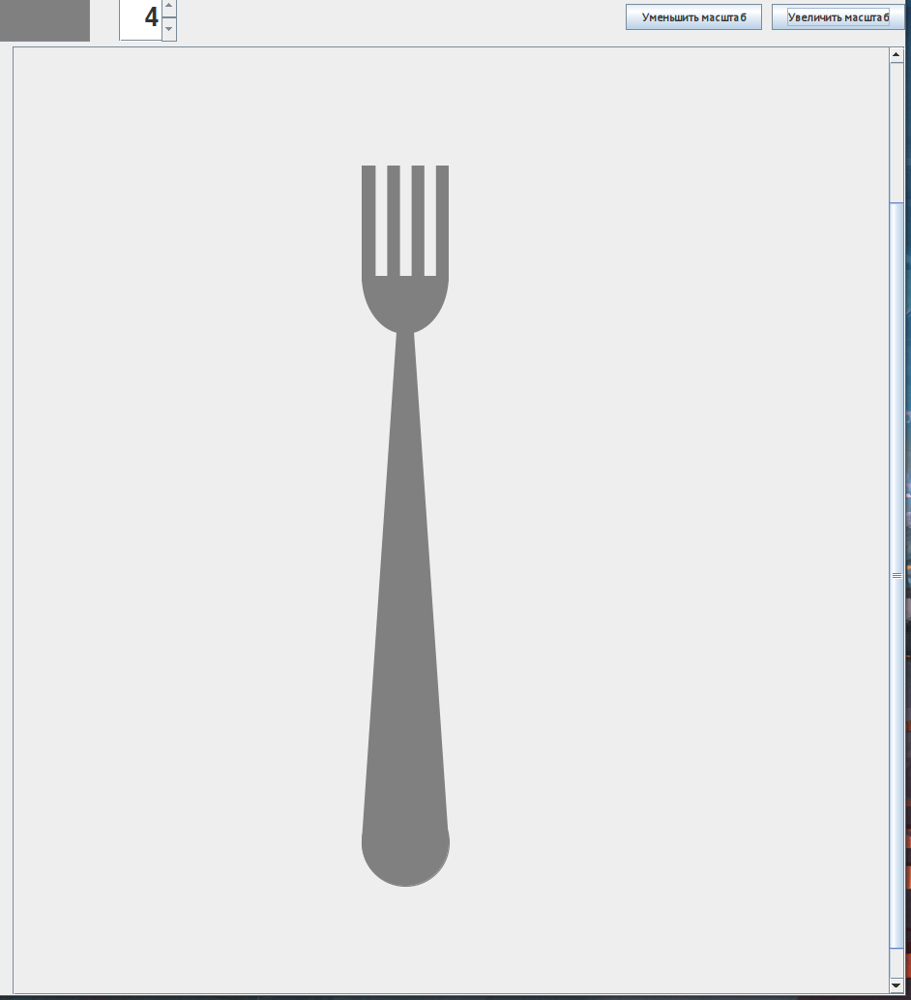
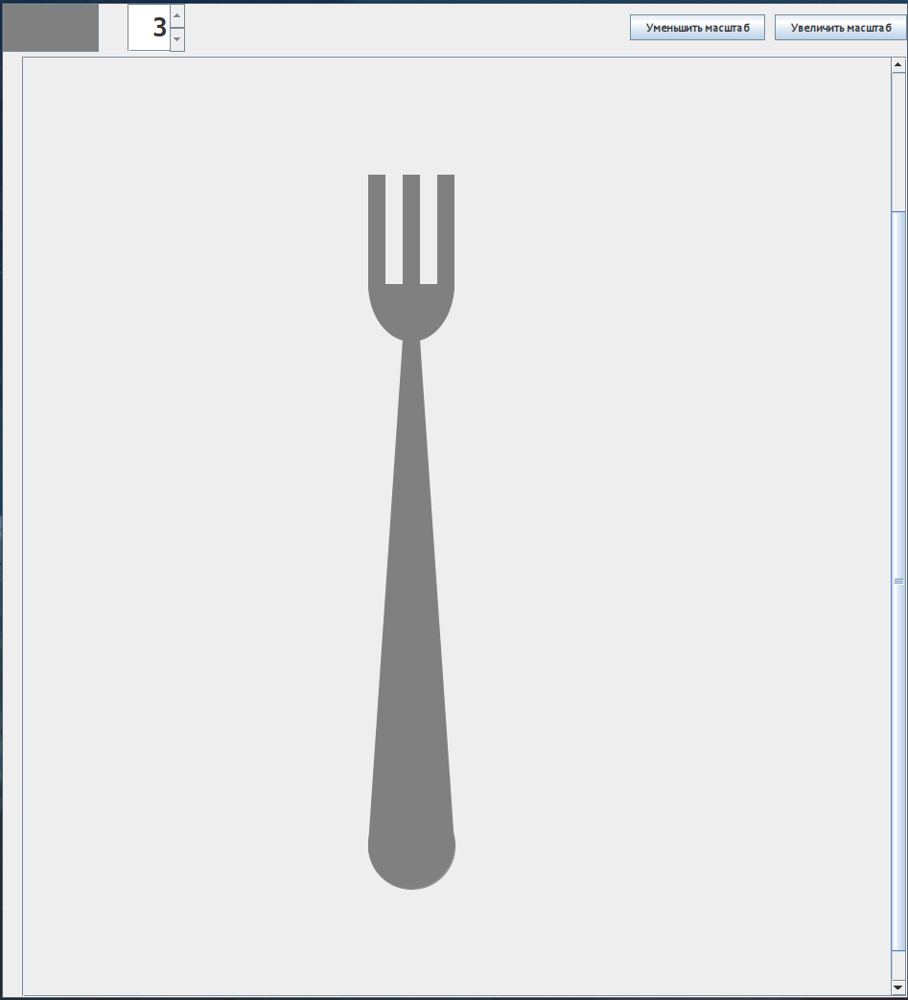
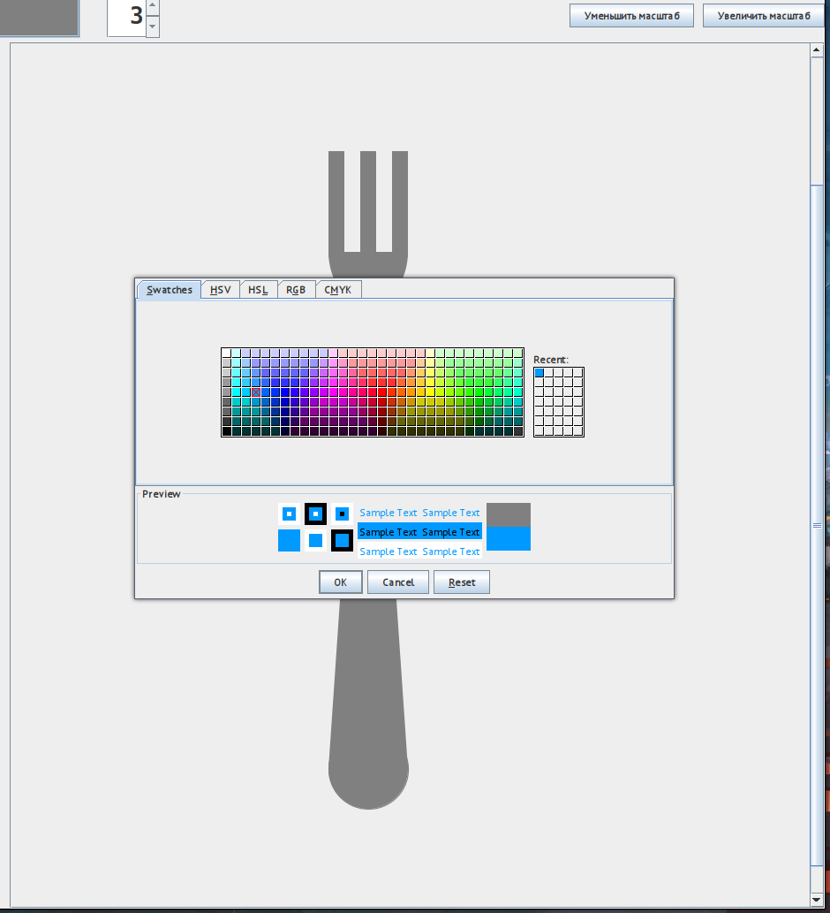
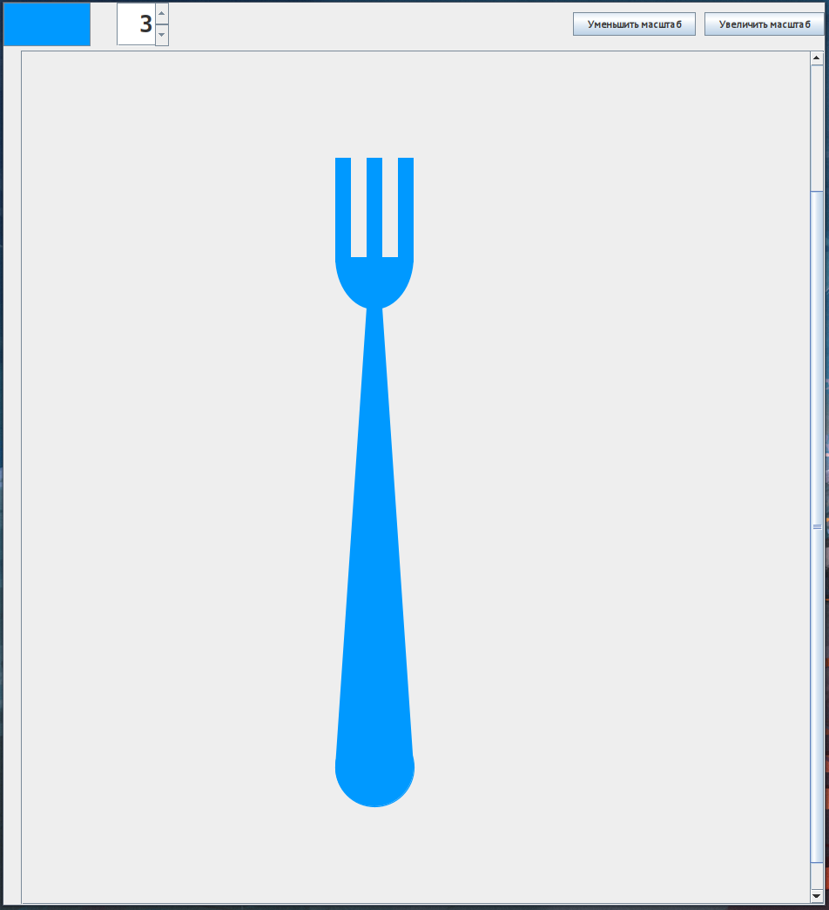
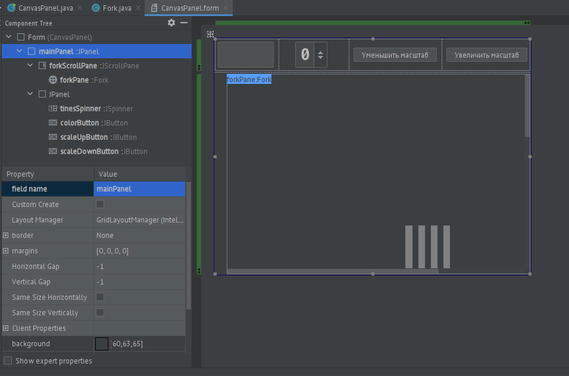

# Цели

Приобретение навыков разработки программ с графическим пользовательским интерфейсом на основе библиотеки `swing`.

# Задачи

35: Вилка выбранного пользователем цвета с n зубьями.

# Решение

### Интерфейс



### Изменение количества зубьев



### Выбор цвета





Также, реализовано изменение масштаба и скролл изображения с помощью мыши или скроллбаров.

## Исходники

### `CanvasPanel.java`

```java
import javax.swing.*;
import javax.swing.event.ChangeEvent;
import javax.swing.event.ChangeListener;
import java.awt.*;
import java.awt.event.*;

public class CanvasPanel {
    private Fork forkPane;
    private JPanel mainPanel;
    private JSpinner tinesSpinner;
    private JButton colorButton;
    private JButton scaleUpButton;
    private JButton scaleDownButton;
    private JScrollPane forkScrollPane;
    private int lastMouseX;
    private int lastMouseY;

    public CanvasPanel() {
        colorButton.setBackground(forkPane.getColor());
        forkPane.setAutoscrolls(true);
        tinesSpinner.addChangeListener(new ChangeListener() {
            @Override
            public void stateChanged(ChangeEvent changeEvent) {
                int newTinesCount = (int)tinesSpinner.getValue();
                forkPane.setTinesCount(newTinesCount);
            }
        });
        colorButton.addActionListener(new ActionListener() {
            @Override
            public void actionPerformed(ActionEvent actionEvent) {
                Color newColor = JColorChooser.showDialog(
                        mainPanel,
                        "Choose Background Color",
                        Color.GRAY);
                forkPane.setColor(newColor);
                colorButton.setBackground(newColor);
            }
        });
        scaleDownButton.addActionListener(new ActionListener() {
            @Override
            public void actionPerformed(ActionEvent actionEvent) {
                forkPane.scaleDown();
                mainPanel.repaint();
                forkScrollPane.updateUI();
            }
        });
        scaleUpButton.addActionListener(new ActionListener() {
            @Override
            public void actionPerformed(ActionEvent actionEvent) {
                forkPane.scaleUp();
                mainPanel.repaint();
                forkScrollPane.updateUI();
            }
        });
        forkPane.addMouseMotionListener(new MouseMotionAdapter() {
            @Override
            public void mouseDragged(MouseEvent e) {
                JViewport viewPort = (JViewport) SwingUtilities.getAncestorOfClass(JViewport.class, forkPane);
                if (viewPort != null) {
                    int deltaX = lastMouseX - e.getX();
                    int deltaY = lastMouseY - e.getY();

                    Rectangle view = viewPort.getViewRect();
                    view.x += deltaX;
                    view.y += deltaY;

                    forkPane.scrollRectToVisible(view);
                }
            }
        });
        forkPane.addMouseListener(new MouseAdapter() {
            @Override
            public void mousePressed(MouseEvent e) {
                lastMouseX = e.getX();
                lastMouseY = e.getY();
            }
        });
    }

    public static void main(String[] args) {
        JFrame frame = new JFrame("Dinner");
        frame.setContentPane(new CanvasPanel().mainPanel);
        frame.setDefaultCloseOperation(JFrame.EXIT_ON_CLOSE);
        frame.pack();
        frame.setVisible(true);
    }

    private void createUIComponents() {
        tinesSpinner = new JSpinner(new SpinnerNumberModel(4,
                1,
                8,
                1));
    }
}
```

### `Fork.java`
```java
import javax.swing.*;
import java.awt.*;

public class Fork extends JPanel {
    private Color color;
    private int tinesCount;
    private double scalingX;
    private double scalingY;

    public Fork() {
        this.color = Color.GRAY;
        this.tinesCount = 4;
        setPreferredSize(new Dimension(700, 1000));
        this.scalingX = 1;
        this.scalingY = 1;
    }

    public void setColor(Color color) {
        this.color = color;
        repaint();
    }

    public Color getColor() {
        return color;
    }

    public void setTinesCount(int tinesCount) {
        this.tinesCount = tinesCount;
        repaint();
    }

    public void scaleUp() {
        this.scalingX += 0.1;
        this.scalingY += 0.1;
        setPreferredSize(new Dimension((int)(700*scalingX), (int)(1000*scalingY)));
        repaint();
    }
    public void scaleDown() {
        this.scalingX -= 0.1;
        this.scalingY -= 0.1;
        setPreferredSize(new Dimension((int)(700*scalingX), (int)(1000*scalingY)));
        repaint();
    }

    @Override
    protected void paintComponent(Graphics g) {
        Graphics2D g2d = (Graphics2D)g;
        g2d.setRenderingHint(RenderingHints.KEY_ANTIALIASING,
                RenderingHints.VALUE_ANTIALIAS_ON);
        g2d.scale(scalingX, scalingY);
        super.paintComponent(g);
        g.setColor(color);
        g.drawOval(300, 800, 75, 75);
        g.fillOval(300, 800, 75, 75);

        g.fillPolygon(new int[]{300, 330, 345, 375}, new int[]{800+(75/2), 398, 398, 800+(75/2)}, 4);
        g.fillArc((345+330)/2-(75/2), 400-100, 75, 100, 0, -180);

        int pos = 300;
        int width = 75 / (tinesCount*2 - 1);
        int ost = 75 % (tinesCount*2 - 1);
        int add = ost % tinesCount;
        for (int i = 0; i < tinesCount; ++i) {
            int tineWidth = width + ost / tinesCount + (i < add ? 1 : 0);
            g.fillRect(pos, 330-75, tineWidth, 100);
            pos += width + tineWidth;
        }
    }
}
```

### Структура UI в IDE


